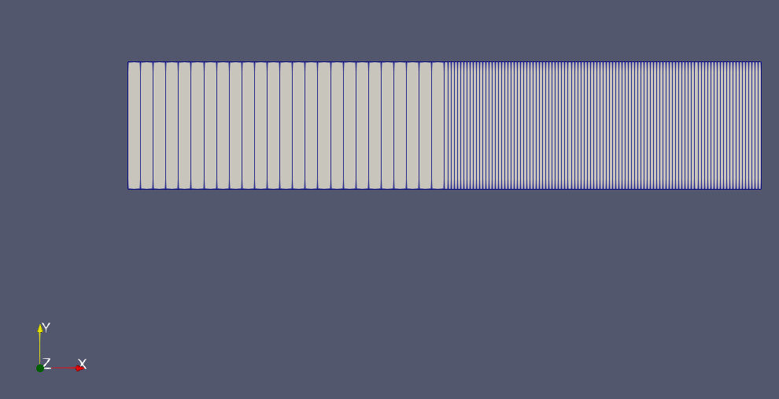

# Basic regridding

Analytical fluid dynamics problems are typically translated into a partial differential equation that has to be solved for some boundary conditions. This introduces the difficulty of having to deal with the geometrical shape of the boundary.

Computational fluid dynamics methods add one small level of complexity on top of this: we need to define an integration grid, including both the boundaries and the points in space were we want our simulation to be accurate.

Our main question here is just how to refine a given grid in OpenFOAM:

## TL;DR
1. Open `./system/blockMeshDict`
2. Increase the mesh resolution inside `blocks` (see below)
3. Execute `blockMesh`
4. Execute `setFields` to update the initial conditions

```c++
blocks
(
    hex (0 1 2 3 4 5 6 7) (1000 1 1) simpleGrading (1 1 1)
    // hex, shape, hexaedron in this case
    // (0 1 ...), ordered list of vertices (defined apart)
    // (1000 1 1) resolution in x, y and z
);
```

## Basic example: square pipe

Our domain is a pipe of square section 1x1, running from -5 to 5 in the x axis.

The information about the grid is stored in `./system/blockMeshDict`. The grid itself is defined under the values `vertices` and `blocks`.

### Vertices

The field vertices contains the "corners" of our domain. Each of them is identified by its order position in the list, starting at 0.

```c++
vertices
(
    (-5 -1 -1) // Vertex 0
    (5 -1 -1) // ...
    (5 1 -1)
    (-5 1 -1)
    (-5 -1 1)
    (5 -1 1)
    (5 1 1)
    (-5 1 1) // Vertex 7
);
```
### Blocks

The field blocks turns a set of vertices into a volumetric grid. Their order is important, and a bit tricky (check [4.1.3](https://www.openfoam.com/documentation/user-guide/mesh-description.php#x11-300004.1.1))

```c++
blocks
(
    hex (0 1 2 3 4 5 6 7) (1000 1 1) simpleGrading (1 1 1)
    // See TL;DR for a step by step description of this file
);
```

### blockMesh

The command `blockMesh` reads `blockMeshDict` and generates a new mesh. The mesh can be inspected with `paraview`.

### setFields

The command `setFields` initializes the initial conditions to match the mesh and the specifications of `setFieldsDict`.

## Practical example: a domain with two grids

Now we want two different grid densities for the square section pipe we mentioned before.

We achieve this by adding more vertices to the center of the pipe:

```c++
vertices
(
    (-5 -1 -1) // Vertex 0
    (0 -1 -1)
    (0 1 -1)
    (-5 1 -1)
    (-5 -1 1)
    (0 -1 1)
    (0 1 1)
    (-5 1 1)
    (0 -1 -1)
    (5 -1 -1)
    (5 1 -1)
    (0 1 -1)
    (0 -1 1)
    (5 -1 1)
    (5 1 1)
    (0 1 1) // Vertex 15
);

```

With the vertices just defined, we can create two blogs differing in density:

```c++
blocks
(
    hex (0 1 2 3 4 5 6 7) (25 1 1) simpleGrading (1 1 1) // Coarse grid
    hex (8 9 10 11 12 13 14 15) (100 1 1) simpleGrading (1 1 1) // Fine grid
);
```

The result looks like:



## Using `refineMesh`

Dealing with geometrical features via text files can be pretty complicated. Luckily, OpenFOAM provides some tools for helping with geometrical operations. `refineMesh` is a good example.

When executed without arguments, it creates a new grid in a time different than the initial (typically t = 0.005, although this depends on the time resolution). Using `refineMesh -overwrite` the initial state is overwritten (typically t = 0).

It is important to note that `refineMesh` does exactly what it says: it refines the mesh, and nothing else. The underlying fields have to be recalculated (for instance, by running `icoFoam` again) or interpolated (see `mapFields` below).

### Interpolate fields with `mapFields`
This subsection is based in this [tutorial](https://www.youtube.com/watch?v=qUMPdkvKBS8).

A typical workflow requiring regridding and interpolating the fields is the reuse of a stationary solution, obtained by a long simulation, as the initial state for a new problem with the same geometry but a denser grid. We will exemplify it with the tutorial available in `tutorials/incompressible/icoFoam/elbow`.

1. Copy the example to your working directory
   ```
   cp [open foam directory]/tutorials/incompressible/icoFoam/elbow [working directory]
   ```
2. Create the coarse and the fine directories
   ```
   cp -r elbow/ coarse/
   cp -r elbow/ fine/
   ```
3. Solve the coarse case
   ```
   cd coarse
   fluentMeshToFoam elbow.msh # Create the mesh
   icoFoam # Simulate the times
   ```
4. Create and refine the mesh corresponding to `fine`
   ```
   cd ../fine
   fluentMeshToFoam elbow.msh # Create the mesh
   refineMesh -overwrite # If overwrite is omited, a new time snapshot is created
   ```
5. Interpolate last state in `coarse` as initial condition for `fine`
   ```
   mapFields -consistent -sourceTime 'latestTime' ../coarse/
   # Use -consistent if the boundaries in fine and coarse are the same
   ```
6. Solve
   ```
   icoFoam
   ```
